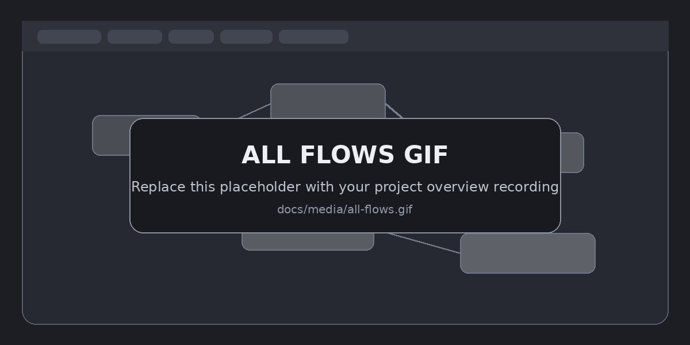
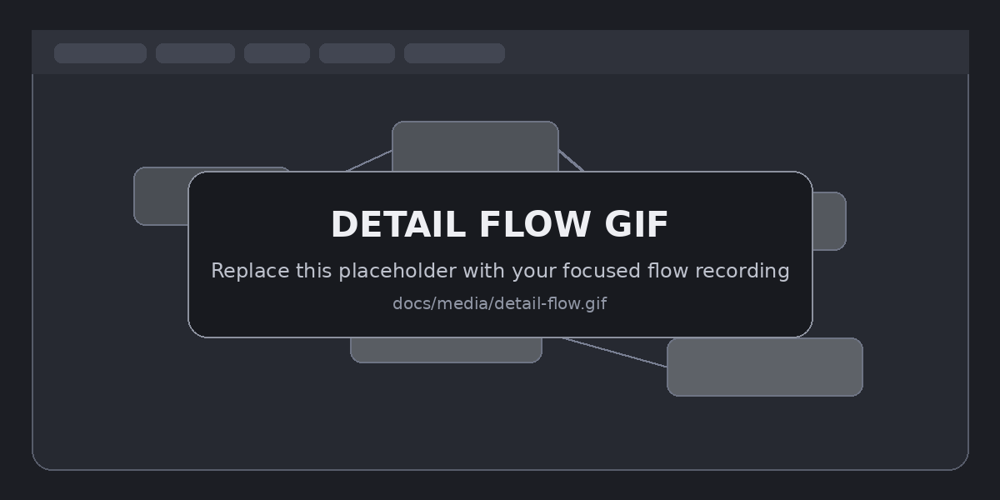

# Flow Graph

<p align="center">
  <strong>Understand Kotlin state as a graph — then watch the graph come alive at runtime.</strong>
</p>

<p align="center">
  <a href="https://jitpack.io/#elivity/flow-graph"></a>
  <a href="LICENSE"></a>
  
  
</p>

Flow Graph is an Android Studio plugin for exploring **Kotlin `Flow`, `StateFlow`, `SharedFlow`, and Jetpack Compose state**.

It combines two views of the same program:

- **static analysis** — where state can flow, which operators transform it, which collectors observe it, and which side effects can write other state;
- **live tracing** — what actually emitted, delivered, recomposed, changed, or was triggered by a UI interaction while the debug app was running.

The goal is to make large reactive Android codebases easier to reason about without mentally following chains across ViewModels, repositories, operators, collectors, helper functions, and Compose.

---

## Why Flow Graph?

A state change that looks simple in code can become difficult to follow once it passes through several layers:

```text
MutableStateFlow
      ↓
asStateFlow
      ↓
combine / map / flatMapLatest
      ↓
stateIn
      ↓
collectAsStateWithLifecycle
      ↓
@Composable
      ↓
side effect
      ↓
another StateFlow
```

Flow Graph turns those relationships into a navigable graph and overlays runtime activity on top of it.

### Highlights

- **All Flows view** — scan the project and see state relationships across the codebase.
- **Focused detail view** — click a node to isolate its upstream causes and downstream effects.
- **K2 semantic analysis** — resolves Kotlin symbols and Flow APIs instead of relying on text/regex matching.
- **Field-level propagation** — tracks fields through transformations such as `copy(...)`, `combine`, and mapped state where it can resolve provenance.
- **Side-effect tracing** — follows collector/helper paths that read one state and write another.
- **Live runtime overlay** — see real emits, deliveries, reads, collection boundaries, Compose state changes, and Compose body executions.
- **Runtime timeline** — pause and scrub backward through relevant runtime activity.
- **UI interaction markers** — touch, key, and scroll interactions appear as bubbles in the timeline so state changes can be correlated with user input.
- **Compose inspection** — link state to composables and inspect/render live Compose surfaces when geometry is available.
- **Source navigation** — click graph edges and nodes to jump back to the responsible call site.
- **Large-graph tooling** — search, auto-fit, zoom-to-cursor, pan, magnifier, recent-activity filtering, and compact focused layouts.
- **Debug only** — the instrumentation Gradle plugin targets the Android `debug` build type; release variants are not instrumented.

---

## Installation

Flow Graph has three pieces, each distributed through the normal ecosystem for that component:

| Component | Distribution |
| --- | --- |
| Android Studio plugin | JetBrains Marketplace |
| Gradle instrumentation plugin | Gradle Plugin Portal |
| Debug runtime | JitPack |

### 1. Install the Android Studio plugin

In Android Studio:

**Settings → Plugins → Marketplace → search `Flow Graph` → Install**

For development builds you can also use **Settings → Plugins → ⚙ → Install Plugin from Disk…** and select the ZIP produced by `./gradlew buildPlugin`.

### 2. Add JitPack

Add JitPack to your normal dependency repositories in `settings.gradle.kts`:

```kotlin
pluginManagement {
    repositories {
        google()
        mavenCentral()
        gradlePluginPortal()
    }
}

dependencyResolutionManagement {
    repositories {
        google()
        mavenCentral()
        maven { url = uri("https://jitpack.io") }
    }
}
```

### 3. Enable instrumentation in the Android app module

In the Android **application** module:

```kotlin
// app/build.gradle.kts
plugins {
    // your existing plugins...
    id("dev.flowgraph.instrumentation") version "0.18.5"
}

dependencies {
    debugImplementation("com.github.elivity:flow-graph:0.18.5")
}
```

The runtime is intentionally a `debugImplementation` dependency.

If plugin versions are centralized at the root:

```kotlin
// root build.gradle.kts
plugins {
    id("dev.flowgraph.instrumentation") version "0.18.5" apply false
}
```

```kotlin
// app/build.gradle.kts
plugins {
    id("dev.flowgraph.instrumentation")
}

dependencies {
    debugImplementation("com.github.elivity:flow-graph:0.18.5")
}
```

### 4. Connect live tracing

Run the debug app on a device/emulator and reverse the local trace port:

```bash
adb reverse tcp:50737 tcp:50737
```

Then turn on **Live** in the Flow Graph tool window.

The runtime transport uses `127.0.0.1:50737`; no cloud service is required for live tracing.

---

## Usage

### Inspect a Flow directly from code

Place the caret on a Kotlin property backed by a supported Flow or Compose state, then either:

- right-click → **Show Flow Graph**; or
- press **Ctrl+Alt+G**.

Flow Graph opens the tool window and builds a semantic graph around that state.

### All Flows — see the project-wide picture

Use **Load all flows** to scan project sources and build an overview of discovered `Flow`, `StateFlow`, `SharedFlow`, and Compose state relationships.

This view is useful when you do not yet know which state is responsible for a behavior, or when you want to understand how state crosses feature/module boundaries.

<p align="center">
  
</p>

> **GIF slot:** replace `docs/media/all-flows.gif` with your real All Flows recording. The README already points to that path.

### Detail Flow — isolate one causal chain

Click a node to switch into a focused graph. The detail view keeps the selected state and its causal neighborhood visible while removing unrelated graph noise.

From there you can:

- expand **Causes ↑** to explore upstream state;
- expand **Affected ↓** to follow downstream impact;
- toggle operators, reads, possible relationships, and library detail;
- click edges to jump to their source call sites;
- inspect field provenance, collectors, side-effect writes, and runtime values in the details pane.

<p align="center">
  
</p>

> **GIF slot:** replace `docs/media/detail-flow.gif` with your real focused/detail-flow recording.

### Live trace

With **Live** enabled, runtime events are overlaid on the same graph rather than shown in a separate profiler.

Depending on configuration, Flow Graph can show:

```text
emit           confirmed StateFlow / SharedFlow write
emit-request   suspending SharedFlow.emit(...) request
collect        collection boundary
 deliver       value delivered through a FlowCollector
read           StateFlow / Compose state read
state-change   effective Compose state change
compose        real Compose body execution
ui             touch / key / scroll interaction
```

Only events relevant to the currently loaded graph are retained for the graph/timeline, which keeps large globally instrumented apps manageable.

### Timeline

The runtime timeline lets you correlate state changes with what happened in the app:

1. run the app with **Live** enabled;
2. interact with the UI;
3. pause the timeline;
4. drag the cursor backward/forward;
5. inspect the graph and details at that point in time.

UI interactions are shown as small bubbles so you can visually line up a tap/scroll/key event with the state changes and Compose work that followed it.

### Current UI / Compose inspection

When a connected debug app exposes inspectable Compose data, **Current UI** can locate a currently visible composable and connect it back to the graph.

Compose rendering is best-effort: a composable that owns real layout geometry can be captured, while effect-only composables (for example a function that only hosts a `LaunchedEffect`) may correctly have no renderable bounds.

---

## Optional instrumentation configuration

The defaults enable the complete debugging experience. You can reduce runtime overhead when you only need part of it:

```kotlin
flowGraphInstrumentation {
    enabled.set(true)

    // StateFlow / Compose reads
    traceReads.set(true)

    // Flow.collect / FlowCollector.emit boundaries
    traceColdFlows.set(true)

    // Suspended MutableSharedFlow.emit(...) requests
    traceSuspendingEmits.set(true)

    // Compose state + composable execution tracing
    traceCompose.set(true)

    // Touch / key / scroll markers for the timeline
    traceUiInteractions.set(true)
}
```

For example, when investigating only StateFlow writes you can disable cold-flow and Compose tracing to reduce instrumentation work.

---

## What Flow Graph understands

### State types

- `Flow`
- `StateFlow` / `MutableStateFlow`
- `SharedFlow` / `MutableSharedFlow`
- Compose `State` / `MutableState`
- primitive Compose state (`IntState`, `LongState`, `FloatState`, `DoubleState` and mutable variants)
- delegated Compose state created through common state factories

### Common Flow operations

Flow Graph recognizes common propagation APIs including:

`map`, `mapLatest`, `mapNotNull`, `filter`, `transform`, `combine`, `combineTransform`, `zip`, `merge`, `flatMapLatest`, `flatMapConcat`, `flatMapMerge`, `scan`, `runningFold`, `stateIn`, `shareIn`, `distinctUntilChanged`, `debounce`, `sample`, `onEach`, `catch`, `retry`, `buffer`, `conflate`, `flowOn`, `take`, `drop`, and related operators.

Collectors include `collect`, `collectLatest`, `launchIn`, `collectAsState`, `collectAsStateWithLifecycle`, `first`, `single`, `toList`, `count`, `reduce`, `fold`, `produceIn`, and related terminal operations.

Writes include `.value =`, `update`, `getAndUpdate`, `updateAndGet`, `emit`, and `tryEmit`.

### Compose state factories

Static analysis recognizes common factories including:

`mutableStateOf`, `derivedStateOf`, `rememberUpdatedState`, `produceState`, `mutableIntStateOf`, `mutableLongStateOf`, `mutableFloatStateOf`, and `mutableDoubleStateOf`.

---

## Static analysis vs. runtime truth

Flow Graph intentionally keeps these concepts separate:

- **Static edges** answer: *what can affect what according to the code?*
- **Runtime activity** answers: *what actually happened during this run?*

Some static relationships are marked **possible** rather than definite. This is important for imperative helper functions, branches, DI/runtime dispatch, and other cases where a read and write can be related in code without proving that the relationship executed on a particular run.

The runtime overlay never turns an unrelated runtime event into a causal edge just because the timestamps happen to be close; observed activity is mapped back onto relationships already supported by the graph.

---

## Current limitations

Flow Graph is a debugging and comprehension tool, not a coroutine virtual machine or a full program verifier.

- Reflection-heavy or highly dynamic code may not resolve statically.
- Arbitrary custom Flow operators may be shown conservatively or omitted when their semantics cannot be established.
- Runtime instrumentation adds overhead and should remain debug-only.
- Compose source/group information depends on compiler/runtime information available in the app and Android Studio version.
- Not every composable has renderable geometry; effect-only composables can be inspectable without producing a UI capture.
- Static "possible" relationships are intentionally not presented as proof of runtime execution.

If Flow Graph cannot establish a relationship with reasonable confidence, the preferred behavior is to leave it unmatched rather than invent a connection.

---

## Development

The current IDE plugin targets the Android Studio 253 platform and uses the Kotlin K2 Analysis API.

Build the Android Studio plugin:

```bash
./gradlew clean test buildPlugin
```

The installable ZIP is created under:

```text
build/distributions/
```

Build the Android-side instrumentation and runtime:

```bash
./gradlew -p instrumentation clean build
```

Test the JitPack-style runtime publication locally:

```bash
./gradlew -p instrumentation :flowgraph-runtime:publishToMavenLocal \
  -Pgroup=com.github.elivity \
  -Partifact=flow-graph \
  -Pversion=0.18.5
```

Release/publishing notes are in [PUBLISHING.md](PUBLISHING.md).

---

## Media for this README

The Usage section is already wired for two recordings:

```text
docs/media/all-flows.gif
docs/media/detail-flow.gif
```

Just replace the included placeholder GIFs with your captures and keep those filenames. No README edit is required.

Recommended for GitHub:

- crop tightly around the Flow Graph tool window;
- 1280–1600 px wide is usually enough;
- keep each GIF reasonably short and compressed;
- demonstrate one idea per GIF rather than recording a long session.

See [docs/media/README.md](docs/media/README.md) for the exact slots.

---

## License

Flow Graph is released under the [MIT License](LICENSE).

Contributions and bug reports are welcome at [github.com/elivity/flow-graph](https://github.com/elivity/flow-graph).
