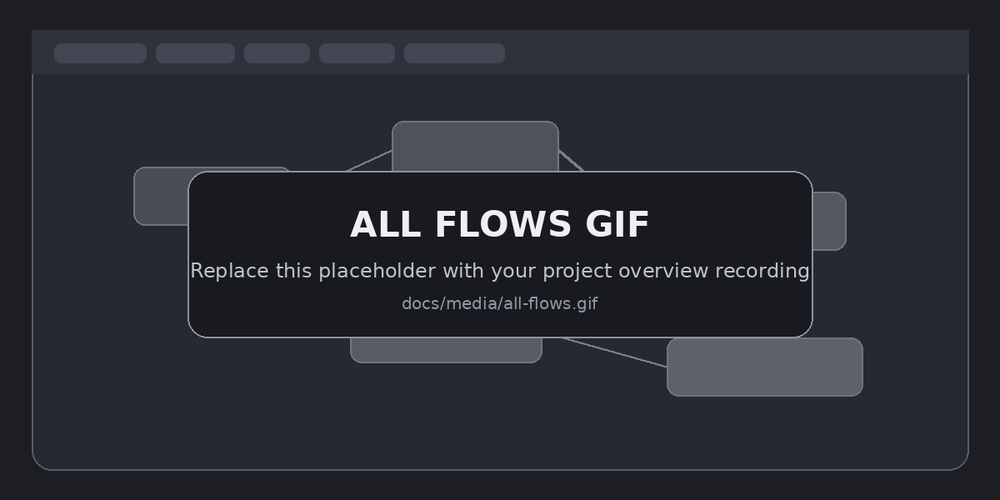
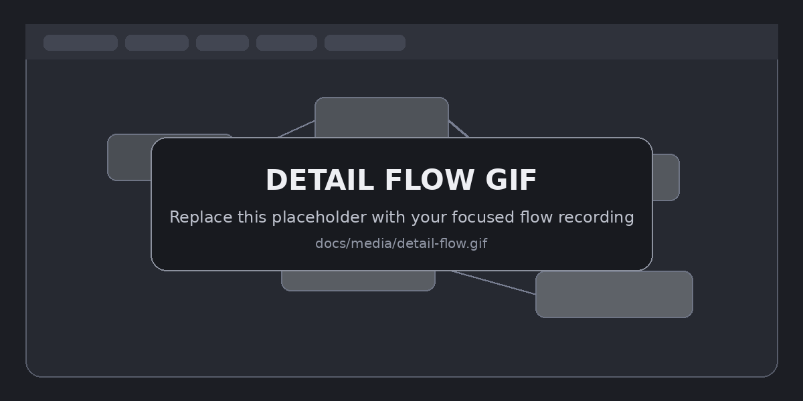

# Flow Graph

<p align="center">
  <strong>Understand Kotlin state as a graph — then watch the graph come alive at runtime.</strong>
</p>

<p align="center">
  <a href="https://jitpack.io/#elivity/flow-graph"></a>
  <a href="LICENSE"></a>
  
  
</p>

**Current release: 0.20.2** · [Installation](docs/INSTALL.md) · [Publishing](PUBLISHING.md)

Flow Graph is an Android Studio plugin for exploring **Kotlin `Flow`, `StateFlow`, `SharedFlow`, and Jetpack Compose state**.

It combines two views of the same program:

- **static analysis** — where state can flow, which operators transform it, which collectors observe it, and which side effects can write other state;
- **live tracing** — what actually emitted, delivered, recomposed, changed, or was triggered by a UI interaction while the debug app was running.

The goal is to make large reactive Android codebases easier to reason about without mentally following chains across ViewModels, repositories, operators, collectors, helper functions, and Compose.

---

## Why Flow Graph?

A state change that looks simple in code can become difficult to follow once it passes through several layers:

```text
MutableStateFlow
      ↓
asStateFlow
      ↓
combine / map / flatMapLatest
      ↓
stateIn
      ↓
collectAsStateWithLifecycle
      ↓
@Composable
      ↓
side effect
      ↓
another StateFlow
```

Flow Graph turns those relationships into a navigable graph and overlays runtime activity on top of it.

### Highlights

- **All Flows view** — scan the project and see state relationships across the codebase. The overview uses separate left-to-right consumer lanes for both Flow and Compose: upstream Flow/State chains are repeated locally beside each consumer/screen when that avoids long cross-canvas connections.
- **Focused detail view** — click a node to isolate its upstream causes and downstream effects.
- **K2 semantic analysis** — resolves Kotlin symbols and Flow APIs instead of relying on text/regex matching.
- **Field-level propagation** — tracks fields through transformations such as `copy(...)`, `combine`, and mapped state where it can resolve provenance.
- **Side-effect tracing** — follows collector/helper paths that read one state and write another.
- **Live runtime overlay** — see real emits, deliveries, reads, collection boundaries, Compose state changes, and Compose body executions.
- **Runtime timeline** — pause and scrub backward through relevant runtime activity.
- **UI interaction markers** — touch, key, and scroll interactions appear as bubbles in the timeline so state changes can be correlated with user input.
- **Compose inspection** — link state to composables and inspect/render live Compose surfaces when geometry is available.
- **Source navigation** — use a node’s square source icon or double-click an edge to open the relevant source without changing node selection.
- **Large-graph tooling** — search, auto-fit, smooth frame-coalesced zoom-to-cursor, pan, magnifier, recent-activity filtering, and compact focused layouts.
- **Debug only** — the instrumentation Gradle plugin targets the Android `debug` build type; release variants are not instrumented.

---

## Namespace

Flow Graph uses the `com.oskiapps.flowgraph` namespace. The Android instrumentation plugin ID is:

```kotlin
id("com.oskiapps.flowgraph.instrumentation")
```

The debug runtime is still distributed through JitPack as `com.github.elivity:flow-graph`, so existing JitPack repository configuration does not change.

## Installation

Flow Graph has three pieces, each distributed through the normal ecosystem for that component:

| Component | Distribution |
| --- | --- |
| Android Studio plugin | JetBrains Marketplace |
| Gradle instrumentation plugin | Gradle Plugin Portal |
| Debug runtime | JitPack |

### 1. Install the Android Studio plugin

In Android Studio:

**Settings → Plugins → Marketplace → search `Flow Graph` → Install**

For development builds you can also use **Settings → Plugins → ⚙ → Install Plugin from Disk…** and select the ZIP produced by `./gradlew buildPlugin`.

### 2. Add JitPack

Add JitPack to your normal dependency repositories in `settings.gradle.kts`:

```kotlin
pluginManagement {
    repositories {
        google()
        mavenCentral()
        gradlePluginPortal()
    }
}

dependencyResolutionManagement {
    repositories {
        google()
        mavenCentral()
        maven { url = uri("https://jitpack.io") }
    }
}
```

### 3. Enable instrumentation in the Android app module

In the Android **application** module:

```kotlin
// app/build.gradle.kts
plugins {
    // your existing plugins...
    id("com.oskiapps.flowgraph.instrumentation") version "0.20.2"
}

dependencies {
    debugImplementation("com.github.elivity:flow-graph:0.20.2")
}
```

The runtime is intentionally a `debugImplementation` dependency.

If plugin versions are centralized at the root:

```kotlin
// root build.gradle.kts
plugins {
    id("com.oskiapps.flowgraph.instrumentation") version "0.20.2" apply false
}
```

```kotlin
// app/build.gradle.kts
plugins {
    id("com.oskiapps.flowgraph.instrumentation")
}

dependencies {
    debugImplementation("com.github.elivity:flow-graph:0.20.2")
}
```

### 4. Connect live tracing

Run the debug app on a device/emulator and reverse the local trace port:

```bash
adb reverse tcp:50737 tcp:50737
```

Then turn on **Live** in the Flow Graph tool window.

The runtime transport uses `127.0.0.1:50737`; no cloud service is required for live tracing.

---

## Usage

### Inspect a Flow directly from code

Place the caret on a Kotlin property backed by a supported Flow or Compose state, then either:

- right-click → **Show Flow Graph**; or
- press **Ctrl+Alt+G**.

Flow Graph opens the tool window and builds a semantic graph around that state.

### All Flows — see the project-wide picture

Use **Load all flows** to scan production project sources and build an overview of discovered `Flow`, `StateFlow`, `SharedFlow`, and Compose state relationships. Test source roots are excluded. All Flows also builds a bounded project Compose topology. The overview deliberately does **not** use shared Flow or Compose declarations as global DAG junctions: each screen/consumer is shown as a hierarchical horizontal lane, and shared nodes may be repeated visually while still mapping back to the same canonical source.

With **Show operators** off (the normal architectural view), the state side of every Compose lane is drawn as a compact **StateFlow dependency graph**. FlowGraph de-duplicates the relevant states inside that screen lane, connects them with semantic state transitions, places the values actually observed by Compose at the graph edge, and then lets them trickle into the Compose tree through short `updates UI` arrows. When **Runtime branches only** is enabled, the graph keeps the observed coroutine machinery too (`map`, `combine`, collectors, behaviors and write sites), so a runtime branch can read `StateFlow -> operator -> writer -> StateFlow -> collector -> Compose` without duplicating shared nodes.

### Horizontal or vertical All Flows layout

When **Circuit** is disabled, use the **Layout** selector in the graph viewport controls to switch each project-overview cluster between **Horizontal** and **Vertical**. The clusters themselves always remain stacked one below another in the same order. Horizontal reads the causal network left-to-right as `upstream Flow/state -> transforms/collectors/writes -> observed state/stage -> Compose`. Vertical transposes that same per-cluster topology into top-to-bottom `Flow/state -> Compose` while keeping node cards upright. Because the same dependency ranks are transposed rather than recomputed as an unrelated layout, branch/fan-in relationships and the right-side cluster navigator stay stable between orientations. Focused/detail graphs intentionally remain horizontal so causal expansion still reads upstream-left and downstream-right.

The graph viewport menu is width-responsive. Visibility filters, zoom/search controls and the layout selector share a wrapping toolbar, so narrowing the IDE/tool window moves controls onto additional rows instead of clipping them or forcing part of the menu off-screen.

A **Clusters** navigator is shown on the right edge of **All Flows** when the overview contains multiple semantic lanes/components. Its buttons use screen names directly and add semantic/source ownership when a lane root is otherwise generic (for example `UserDataRepository — collect` instead of only `collect`). The navigator follows the viewport automatically: panning or scrolling highlights the cluster currently under the camera, scrolls that bookmark into view in the rail, and highlights the same cluster boundary in the main graph. Clicking a bookmark remains a bookmark-style jump: FlowGraph fits that cluster to a readable zoom and centers it without converting it into a focused causal detail graph. The navigator is hidden in focused detail views and regenerated whenever visibility filters or overview packing rebuild the clusters.

The live **UI render** pane is also detail-only. All Flows keeps the graph viewport and ordinary details pane; selecting a node opens the focused detail graph and makes the UI render pane available for that inspection.

Compose topology also follows project lazy-layout DSL helpers that are not themselves `@Composable`. For example, a source helper such as `fun LazyStaggeredGridScope.newsFeed(...) { items(...) { NewsResourceCardExpanded(...) } }` is represented as `LazyVerticalStaggeredGrid -> newsFeed -> items -> NewsResourceCardExpanded`. The helper is static topology only; recomposition counts remain attached to the actual source `@Composable` descendants.

The **View settings** menu contains visibility checkboxes for: **Compose state**, **Coroutine Flow/StateFlow**, and **Compose views**. They apply consistently to both **All Flows** and focused/detail views. Toggling one rebuilds the currently visible graph and re-packs the remaining content, so hidden layers never leave empty layout holes or reappear when a node is focused.

Use **Flow-influenced UI only** as a structural impact lens when you only want Compose nodes that are causally reached by a coroutine `Flow`/`StateFlow`/`SharedFlow`. FlowGraph follows state-to-state propagation (including an intermediate Compose State) to an `UPDATES_COMPOSE` relationship, removes unrelated Compose branches, then rebuilds, re-packs, and fits the graph. Composition alone does not imply Flow influence: children are not retained merely because an observing parent composes them. The filter still works when the **Coroutine Flow/StateFlow** layer itself is hidden, which is useful for a Compose-only list of affected views.

Use **Project composables only** when you want the Compose architecture without AndroidX/framework layout primitives. Nodes such as `Column`, `Row`, `Text`, `Surface`, `Offset`, and other synthetic Compose UI call sites are removed, but the graph contracts through them so project composables stay connected to their nearest project-composable ancestors/descendants. The same filter applies to All Flows and detail view and triggers a compact relayout.

Tooling-only Compose previews are excluded from the architecture graph: functions annotated with `@Preview` (including common preview-style/multi-preview annotation names) are not admitted as production Compose nodes or roots.

Compose branches are laid out as independent horizontal composition lanes from left to right. Source composables stay as inspectable nodes, while visual AndroidX Compose call sites such as `Column`, `LazyVerticalGrid`, `Button`, and `Text` can appear between them. A lane can therefore read like `ForYouScreen → LazyVerticalGrid → TopicCard → Button → Text`. Reused composables are allowed to appear more than once: each visual copy maps to the same source declaration, but stays local to its lane instead of creating long cross-screen edges. Common infrastructure such as `CompositionLocalProvider`, `…Theme`, `Surface`, `Scaffold`, and `NavHost` is treated as optional lane-local context rather than a mandatory global root.

Each lane also carries its own local Flow/State influence prefix, matching the focused detail view: upstream state and operators are repeated immediately to the left of the screen they can recompose. For example, a lane can read `MutableStateFlow → StateFlow → collectAsStateWithLifecycle → ForYouScreen → LazyVerticalGrid → …`. If the same state feeds several screens, the overview may repeat that state beside each screen rather than drawing long cross-lane connections. A `…Route` that owns `collectAsState*` can remain omitted as the visual root while its update is projected to the nearest visible screen descendant.

This view is useful when you do not yet know which state is responsible for a behavior, or when you want to understand how state crosses feature/module boundaries.

<p align="center">
  
</p>

> **GIF slot:** replace `docs/media/all-flows.gif` with your real All Flows recording. The README already points to that path.

### Detail Flow — isolate one causal chain

Click a node in the overview to switch into a focused graph. Within the focused graph, clicking another node inspects it without moving the viewport. The detail view keeps the selected state and its causal neighborhood visible while removing unrelated graph noise.

From there you can:

- expand **Causes ↑** to explore upstream state;
- expand **Affected ↓** to follow downstream impact;
- toggle operators, reads, possible relationships, and library detail;
- click an edge to highlight only that rendered flow/lane path; duplicated copies of the same Flow variable in other lanes stay dimmed; double-click the edge to jump to its source call site;
- inspect field provenance, collectors, side-effect writes, and runtime values in the details pane.

<p align="center">
  
</p>

> **GIF slot:** replace `docs/media/detail-flow.gif` with your real focused/detail-flow recording.

### Live trace

Live-specific controls are hidden until **Live** is enabled. With **Live** enabled, runtime events are overlaid on the same graph rather than shown in a separate profiler.

Depending on configuration, Flow Graph can show:

```text
emit           confirmed StateFlow / SharedFlow write
emit-request   suspending SharedFlow.emit(...) request
collect        collection boundary
 deliver       value delivered through a FlowCollector
read           StateFlow / Compose state read
state-change   effective Compose state change
compose        real Compose body execution
ui             touch / key / scroll interaction
```

Only events relevant to the currently loaded graph are retained for the graph/timeline, which keeps large globally instrumented apps manageable.

### Timeline

The runtime timeline lets you correlate state changes with what happened in the app:

1. run the app with **Live** enabled;
2. interact with the UI;
3. pause the timeline;
4. drag the cursor backward/forward;
5. inspect the graph and details at that point in time.

UI interactions are shown as small bubbles so you can visually line up a tap/scroll/key event with the state changes and Compose work that followed it.

### Current UI / Compose inspection

Current UI targets the **most specific substantial visible project composable**, rather than simply the largest/root composable. This means switching to another tab or nested screen should focus that active tab/screen when it is represented in the graph. Very small child controls are deliberately excluded from taking over the selection.


Current UI diagnostics are also retained in the Live **ⓘ** panel. If Current UI fails or times out, FlowGraph automatically opens **ⓘ** and keeps the full runtime diagnostic/counter message there while leaving only a short status in the header.


When a connected debug app exposes inspectable Compose data, **Current UI** can locate a currently visible composable and connect it back to the graph.

Compose rendering is best-effort: a composable that owns real layout geometry can be captured, while effect-only composables (for example a function that only hosts a `LaunchedEffect`) may correctly have no renderable bounds.

---

## Optional instrumentation configuration

The defaults enable the complete debugging experience. You can reduce runtime overhead when you only need part of it:

```kotlin
flowGraphInstrumentation {
    enabled.set(true)

    // StateFlow / Compose reads
    traceReads.set(true)

    // Flow.collect / FlowCollector.emit boundaries
    traceColdFlows.set(true)

    // Suspended MutableSharedFlow.emit(...) requests
    traceSuspendingEmits.set(true)

    // Compose state + composable execution tracing
    traceCompose.set(true)

    // Touch / key / scroll markers for the timeline
    traceUiInteractions.set(true)
}
```

For example, when investigating only StateFlow writes you can disable cold-flow and Compose tracing to reduce instrumentation work.

---

## What Flow Graph understands

### State types

- `Flow`
- `StateFlow` / `MutableStateFlow`
- `SharedFlow` / `MutableSharedFlow`
- Compose `State` / `MutableState`
- primitive Compose state (`IntState`, `LongState`, `FloatState`, `DoubleState` and mutable variants)
- delegated Compose state created through common state factories

### Common Flow operations

Flow Graph recognizes common propagation APIs including:

`map`, `mapLatest`, `mapNotNull`, `filter`, `transform`, `combine`, `combineTransform`, `zip`, `merge`, `flatMapLatest`, `flatMapConcat`, `flatMapMerge`, `scan`, `runningFold`, `stateIn`, `shareIn`, `distinctUntilChanged`, `debounce`, `sample`, `onEach`, `catch`, `retry`, `buffer`, `conflate`, `flowOn`, `take`, `drop`, and related operators.

Collectors include `collect`, `collectLatest`, `launchIn`, `collectAsState`, `collectAsStateWithLifecycle`, `first`, `single`, `toList`, `count`, `reduce`, `fold`, `produceIn`, and related terminal operations.

Writes include `.value =`, `update`, `getAndUpdate`, `updateAndGet`, `emit`, and `tryEmit`.

### Compose state factories

Static analysis recognizes common factories including:

`mutableStateOf`, `derivedStateOf`, `rememberUpdatedState`, `produceState`, `mutableIntStateOf`, `mutableLongStateOf`, `mutableFloatStateOf`, and `mutableDoubleStateOf`.

---

## Static analysis vs. runtime truth

Flow Graph intentionally keeps these concepts separate:

- **Static edges** answer: *what can affect what according to the code?*
- **Runtime activity** answers: *what actually happened during this run?*

Some static relationships are marked **possible** rather than definite. This is important for imperative helper functions, branches, DI/runtime dispatch, and other cases where a read and write can be related in code without proving that the relationship executed on a particular run.

The runtime overlay never turns an unrelated runtime event into a causal edge just because the timestamps happen to be close; observed activity is mapped back onto relationships already supported by the graph.

---

## Current limitations

Flow Graph is a debugging and comprehension tool, not a coroutine virtual machine or a full program verifier.

- Reflection-heavy or highly dynamic code may not resolve statically.
- Arbitrary custom Flow operators may be shown conservatively or omitted when their semantics cannot be established.
- Runtime instrumentation adds overhead and should remain debug-only.
- Compose source/group information depends on compiler/runtime information available in the app and Android Studio version.
- Not every composable has renderable geometry; effect-only composables can be inspectable without producing a UI capture.
- Static "possible" relationships are intentionally not presented as proof of runtime execution.
- Direct Compose State reads are attributed to the enclosing composable. A read that exists only inside a later non-composable callback/effect lambda (for example an `onClick` callback) can therefore be conservatively over-attributed as a recomposition dependency; distinguishing every callback lambda from composable content requires deeper function-type/call-site analysis.
- Flow values returned from nested lambdas of higher-order operators (for example an arbitrary inner Flow selected inside a complex `flatMapLatest` lambda) may be incomplete when the dependency is not a direct receiver or direct Flow-valued call argument.
- Exact Flow/State classification is based on resolved coroutine/Compose state types; unusual custom subtypes/typealiases may be omitted rather than guessed.

If Flow Graph cannot establish a relationship with reasonable confidence, the preferred behavior is to leave it unmatched rather than invent a connection.

---

## Development

The current IDE plugin targets the Android Studio 253 platform and uses the Kotlin K2 Analysis API.

Build the Android Studio plugin:

```bash
./gradlew clean test buildPlugin
```

The installable ZIP is created under:

```text
build/distributions/
```

Build the Android-side instrumentation and runtime:

```bash
./gradlew -p instrumentation clean build
```

Test the JitPack-style runtime publication locally:

```bash
./gradlew -p instrumentation :flowgraph-runtime:publishToMavenLocal \
  -Pgroup=com.github.elivity \
  -Partifact=flow-graph \
  -Pversion=0.20.2
```

Release/publishing notes are in [PUBLISHING.md](PUBLISHING.md).

---

## Media for this README

The Usage section is already wired for two recordings:

```text
docs/media/all-flows.gif
docs/media/detail-flow.gif
```

Just replace the included placeholder GIFs with your captures and keep those filenames. No README edit is required.

Recommended for GitHub:

- crop tightly around the Flow Graph tool window;
- 1280–1600 px wide is usually enough;
- keep each GIF reasonably short and compressed;
- demonstrate one idea per GIF rather than recording a long session.

See [docs/media/README.md](docs/media/README.md) for the exact slots.

---

## License

Flow Graph is released under the [MIT License](LICENSE).

Contributions and bug reports are welcome at [github.com/elivity/flow-graph](https://github.com/elivity/flow-graph).


### Filtering inferred connections

Use **Possible connections** in the graph header to show/hide inferred read→write causality. Turning it off structurally rebuilds and repacks the graph instead of merely hiding dashed lines, so possible-only helper nodes and the empty space they occupied disappear as well. **Expand possible** in Extras separately controls whether visible possible edges may expand a focused causal cone.


### Compose runtime identity

Source composable activity uses `@compose2|package|file|functionName|sourceLine`. The source line prevents overloaded or repeated same-name composables in the same Kotlin file from sharing one runtime identity. Legacy `@compose|...` events are still accepted when they are unambiguous; rebuild the debug APK to get the precise v2 identity.

### Live Compose geometry compatibility

Live **Current UI / Render UI** capture resolves `LayoutInfo` ownership across Compose UI versions using the current `LayoutInfo_androidKt.getView(LayoutInfo)` tooling bridge, the recent `opaqueOwner` API, and the older internal owner fallback. This keeps live composable bounds/capture working when the Compose tooling owner API changes between releases.


### Live Compose Current UI geometry compatibility

- Current UI no longer discards valid LayoutInfo geometry merely because the owning Android View cannot be resolved immediately.
- Layout owner lookup now also follows `LayoutCoordinates -> NodeCoordinator -> LayoutNode -> owner`, with Activity decor/AndroidComposeView fallback.
- Current UI failures now report diagnostic counts for composition groups, group-key/source matches, LayoutInfo nodes, coordinates, positions, owners, and geometry matches.


### Concise overview

`Concise overview` is enabled by default for **All Flows**. It treats the overview as an architecture map rather than a literal call graph: duplicate Compose call sites are folded, read-only observer leaves are grouped by owner, long causal captions are reduced to semantic verbs, and StateFlow propagation is arranged as a compact state machine feeding the Compose hierarchy. Compose subtrees stay visible in the overview rather than being replaced by descendant summary controls. Selecting a normal node switches to the focused graph, where the complete paths/call sites are still available. Disable the checkbox at any time to see the literal overview.

### Runtime-observed branches

Use **Runtime branches only** in **All Flows** to rebuild the overview from branches that have concrete runtime evidence since the last **Clear runtime**. FlowGraph now keeps the causal coroutine graph itself—StateFlow/SharedFlow states, transforms, collectors, behaviors, exposures and write sites—rather than collapsing runtime evidence to state boxes only. Field-detail nodes are contracted into semantic edges such as `writes state`/`produces state`, and retained Flow/state nodes keep their static `updates UI` endpoints plus the Compose ancestor chain, so you can see both what triggered what and which Compose view that live branch can influence. Inactive Flow and Compose sibling branches are omitted. The filter is session-persistent rather than a 2.5-second hot window: once a branch has executed it remains visible until runtime history is cleared. Selecting a node still opens the complete detail graph.
